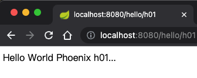

# Phoenix Hello World 示例

## 运行启动

依赖环境：
- JDK 1.8
- Maven 3.3+

运行脚本：
```shell
mvn spring-boot:run
curl -X GET http://127.0.0.1:8080/hello/h001 
```

### Step 1: 引入依赖

```xml
<dependency>
    <groupId>com.iquantex</groupId>
    <artifactId>phoenix-server-starter</artifactId>
    <version>2.4.0</version>
</dependency>
<dependency>
    <groupId>com.iquantex</groupId>
    <artifactId>phoenix-client-starter</artifactId>
    <version>2.4.0</version>
</dependency>
```

### Step 2: 配置文件

```yaml
spring:
  application:
    name: hello # 自定义服务名称

quantex:
  phoenix:
    client:
      name: ${spring.application.name}-client	# 服务名称
      mq:
        type: kafka	                            # mq类型
        address: 127.0.0.1:9092                 # mq地址
    server:
      name: ${spring.application.name}    # 服务名称
      package-name: com.iquantex.phoenix.samples.account   # 聚合根包所在路径
      mq:
        type: kafka                       # mq类型
        address: 127.0.0.1:9092           # mq服务地址
        subscribe:
          - topic: ${spring.application.name}
      event-store:
        driver-class-name: org.h2.Driver  # 数据库驱动
        data-sources:
          - url: jdbc:h2:file:./data/test;DB_CLOSE_DELAY=-1;DATABASE_TO_UPPER=FALSE;INIT=CREATE SCHEMA IF NOT EXISTS PUBLIC # 数据库链接url
            username: sa                  # 数据库账户
            password:                     # 数据库密码
```

### Step 3: 消息定义

关于 Command 和 Event 解释可以 [参考详细文档](https://phoenix.iquantex.com/docs/phoenix-2.x/phoenix-core/phoenix-core-event-souring) 。

聚合根接收 **Command** 产生 **Event**。**Command** 和 **Event** 需要实现 **Serializable** 接口。

Phoenix 支持 `Protostuff`、`Java Bean`、`Protobuf` 等序列化协议，可以通过以下配置进行指定。

```yaml
quantex.phoenix.server.default-serializer: proto_stuff
```

本文使用`Java Bean`序列化协议进行示范。

#### Command定义

```java
@Data
@NoArgsConstructor
@AllArgsConstructor
public class HelloCmd implements Serializable {
  private static final long serialVersionUID = -8667685124103764667L;
	/** hello 指令id */
    private String helloId;
}
```

#### Event定义

```java
@Data
@NoArgsConstructor
@AllArgsConstructor
public class HelloEvent implements Serializable {
  private static final long serialVersionUID = 4778468915465985552L;
	/** hello 指令id */
    private String helloId;
}
```

### Step 4: 聚合根定义

**聚合根类定义规则：**

1. 聚合根类需要使用 `@EntityAggregateAnnotation` 进行标记,`aggregateRootType` 值需要全局唯一
2. 聚合根类需要实现`Serializable`接口
3. `act` 方法接收**Command**，`act` 方法只能包含一个入参且方法返回值为`ActReturn`。
4. `act`方法需要增加 `@CommandHandler` 或 `@QueryHandler`,其中 `aggregateRootId` 为聚合根id
5. `on` 方法接收**Event**，`on` 方法只能包含一个入参且方法返回值为`void`

```java
/**
 * hello 聚合根
 */
@Slf4j
@Data
@EntityAggregateAnnotation(aggregateRootType = "Hello")
public class HelloAggregate implements Serializable {

    private static final long serialVersionUID = -1L;

    /**
     * 状态: 计数器
     */
    private long num;

    /**
     * 处理hello指令,产生HelloEvent
     * @param cmd hello 指令
     * @return 处理结果
     */
    @CommandHandler(aggregateRootId = "helloId")
    public ActReturn act(HelloCmd cmd) {
        return ActReturn.builder().retCode(RetCode.SUCCESS)
                .retMessage("Hello World Phoenix " + cmd.getHelloId() + "...").event(new HelloEvent(cmd.getHelloId()))
                .build();
    }

    /**
     * 处理helloEvent
     * @param event hello事件
     */
    public void on(HelloEvent event) {
        num++;
        log.info("Phoenix State: {}", num);
    }

}
```

### Step 5: REST API 定义

增加`phoenix-client-starter`依赖启动服务后 **Phoenix** 会自动注入 **PhoenixClient** Bean，可以通过调用 **PhoenixClient** 的 **send()** 发送 Command 信息

```java
@Slf4j
@RestController
public class HelloController {

    @Value("${spring.application.name}")
    private String topic;

    @Autowired
    private PhoenixClient client;

    @GetMapping("/hello/{helloId}")
    public String send(@PathVariable String helloId) throws ExecutionException, InterruptedException {
        HelloCmd helloCmd = new HelloCmd(helloId);
        Future<RpcResult> future = client.send(helloCmd, topic, "");
        return future.get().getMessage();
    }

}
```

### 总结
恭喜！您已经完成用 Phoenix 构建一个 Hello World 工程。



## 相关链接

- [实体聚合根文档](https://phoenix.iquantex.com/docs/phoenix-2.x/phoenix-core/phoenix-core-entity-aggregate)

- [Phoenix Client 文档](https://phoenix.iquantex.com/docs/phoenix-2.x/phoenix-core/phoenix-core-client)

- [配置文件文档](https://phoenix.iquantex.com/docs/phoenix-2.x/phoenix-core/phoenix-core-config)


