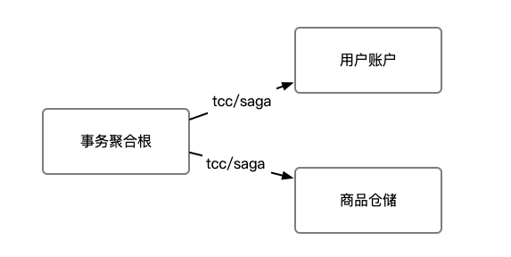

## 用户购物

购买商品是常见的业务场景，一般涉及购买方账户扣减，以及商家库存扣减，和订单生成。该case为了简化，不生成订单。

整个业务逻辑由2个聚合根(微服务)构成:

1. 仓储服务: 对给定的商品扣除仓储数量。
2. 帐户服务：从用户帐户中扣除余额。


## 架构图




## 仓储服务
仓储服务的实现是一个实体聚合根，提供saga和tcc接口。
```java

@EntityAggregateAnnotation(aggregateRootType = "GoodsTcc")
public class GoodsAggregate implements Serializable {
}
```

### TCC接口
TCC接口提供`GoodsTryCmd`、`GoodsConfirmCmd`、`GoodsCancelCmd`命令。TCC操作在Try接口会预冻结金额，在Confirm阶段解冻。
```java
    @CommandHandler(aggregateRootId = "goodsCode")
    public ActReturn act(GoodsTryCmd cmd) {
        if (qty - frozenQty > cmd.getFrozenQty()) {
            return ActReturn.builder().retCode(RetCode.SUCCESS)
                .event(new GoodsTryOkEvent(cmd.getGoodsCode(), cmd.getFrozenQty())).build();
        } else {
            String retMessage = String.format("商品可用不足，剩余:%d, 当前需要冻结:%d", qty - frozenQty, cmd.getFrozenQty());
            return ActReturn.builder().retCode(RetCode.FAIL).retMessage(retMessage)
                .event(new GoodsTryFailEvent(cmd.getGoodsCode(), cmd.getFrozenQty(), retMessage)).build();
        }
    }

    public void on(GoodsTryOkEvent event) {
        frozenQty += event.getFrozenQty();
    }

    public void on(GoodsTryFailEvent event) {
    }

    @CommandHandler(aggregateRootId = "goodsCode")
    public ActReturn act(GoodsConfirmCmd cmd) {
        return ActReturn.builder().retCode(RetCode.SUCCESS)
            .event(new GoodsConfirmOkEvent(cmd.getGoodsCode(), cmd.getFrozenQty())).build();
    }

    public void on(GoodsConfirmOkEvent event) {
        qty -= event.getFrozenQty();
        frozenQty -= event.getFrozenQty();

    }

    @CommandHandler(aggregateRootId = "goodsCode")
    public ActReturn act(GoodsCancelCmd cmd) {
        return ActReturn.builder().retCode(RetCode.SUCCESS)
            .event(new GoodsCancelOkEvent(cmd.getGoodsCode(), cmd.getFrozenQty())).build();
    }

    public void on(GoodsCancelOkEvent event) {
        frozenQty -= event.getFrozenQty();

    }
```

### Saga接口
Saga接口提供`GoodsSellCmd`和`GoodsSellCompensateCmd`命令。Saga本身是没有预留的，不过由于业务是`扣减`所以不预留冻结是可以接受的，只会出现`少卖`而不会出现`超卖`场景。

```java

    @CommandHandler(aggregateRootId = "goodsCode")
    public ActReturn act(GoodsSellCmd cmd) {
        if (cmd.getQty() < 0) {
            throw new RuntimeException("数不能小于0");
        }
        if (qty > cmd.getQty()) {
            return ActReturn.builder().retCode(RetCode.SUCCESS)
                .event(new GoodsSellOkEvent(cmd.getGoodsCode(), cmd.getQty())).build();
        } else {
            String ret = String.format("余额不足，剩余:%d, 当前需要:%d", qty, cmd.getQty());
            return ActReturn.builder().retCode(RetCode.FAIL).retMessage(ret)
                .event(new GoodsSellFailEvent(cmd.getGoodsCode(), cmd.getQty(), ret)).build();
        }
    }

    public void on(GoodsSellOkEvent event) {
        qty -= event.getQty();
    }

    public void on(GoodsSellFailEvent event) {
    }

    @CommandHandler(aggregateRootId = "goodsCode")
    public ActReturn act(GoodsSellCompensateCmd cmd) {
        return ActReturn.builder().retCode(RetCode.SUCCESS)
            .event(new GoodsSellCompensateOkEvent(cmd.getGoodsCode(), cmd.getQty())).build();
    }

    public void on(GoodsSellCompensateOkEvent event) {
        qty += event.getQty();
    

```

## 帐户服务
账户服务的实现是一个实体聚合根，提供saga和tcc接口。
```java
@EntityAggregateAnnotation(aggregateRootType = "AccountAggregate")
public class AccountAggregate implements Serializable {
}
```

在商品购买场景中账户服务也是对金额的`扣减`，同样可以提供TCC和SAGA接口，可以参考[AccountAggregate](account/AccountAggregate.java)。


## 事务聚合根

phoenix事务聚合根可以对实体聚合根提供的`tcc`和`saga`接口灵活组装。该案例提供了`TCC+Saga`模式。

事务聚合根在接收到购买命令时,分别返回`账户服务TCC`和`仓储服务Saga`的命令给到事务状态机，事务状态机会发送并协调驱动达到最终状态。

```java
@TransactionAggregateAnnotation(aggregateRootType = "ShoppingAggregateTcc")
public class ShoppingAggregateTcc implements Serializable {

    private static final long serialVersionUID = 7007603076743033374L;
    private BuyGoodsCmd buyGoodsCmd;
    private String remark = "";

    @TransactionStart
    public TransactionReturn act(BuyGoodsCmd request) {
        this.request = request;
        double frozenAmt = request.getQty() * request.getPrice();
        return TransactionReturn
                .builder()
                .addAction(
                        TccAction.builder().tryCmd(new AccountTryCmd(request.getAccountCode(), frozenAmt))
                                .confirmCmd(new AccountConfirmCmd(request.getAccountCode(), frozenAmt))
                                .cancelCmd(new AccountCancelCmd(request.getAccountCode(), frozenAmt)).targetTopic("")
                                .subTransId(UUID.randomUUID().toString()).build())
                .addMetaData("request", request)
                .addAction(
                        SagaAction.builder().targetTopic("").tiCmd(new GoodsSellCmd(request.getGoodsCode(), request.getQty()))
                                .ciCmd(new GoodsSellCompensateCmd(request.getGoodsCode(), request.getQty()))
                                .subTransId(UUID.randomUUID().toString()).build()).addMetaData("try", "ok").build();
    }
    // other event handler
}
```


## 快速启动
1. 运行ShoppingApplication
2. 调用接口购买商品
```shell
PUT http://127.0.0.1:8080/shopping/buy_goods/{accountCode}/{goodsCode}/{qty}/{price}
```
3. 查询账户和商品
```shell
GET http://127.0.0.1:8080/shopping/account/{accountCode}
GET http://127.0.0.1:8080/shopping/goods/{goodsAccount}
```

